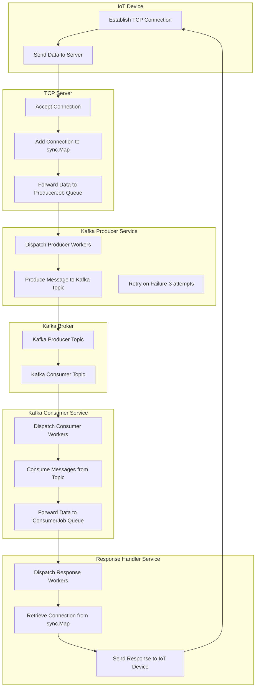

# Kafka-TCP-Service

The **Kafka-TCP-Service** is a scalable, high-performance TCP server designed to handle incoming connections from IoT devices, process their messages using Kafka, and return responses efficiently using a worker-pool pattern.

---

## 📋 **Table of Contents**

- [Introduction](#introduction)
- [Architecture](#architecture)
- [Workflow](#workflow)
- [Directory Structure](#directory-structure)
- [Setup and Installation](#setup-and-installation)
- [Configuration](#configuration)
- [Usage](#usage)
- [Contributing](#contributing)
- [License](#license)

---

## Introduction

The **Kafka-TCP-Service** is built to handle multiple TCP connections from IoT devices. It integrates with Kafka for asynchronous message processing and uses a worker-pool pattern to maximize the efficient use of resources. The system ensures reliable communication between IoT devices and backend services through Kafka topics.

### Key Features:

- Handles thousands of simultaneous TCP connections
- Uses Kafka for message queuing and asynchronous processing
- Worker-pool pattern for efficient resource management
- Stores active connections in `sync.Map` for quick retrieval

---

## Architecture



---

## Workflow

1. IoT devices establish a TCP connection with the server.
2. The server accepts the connection and stores it in a `sync.Map`.
3. Data received from the IoT device is added to the `ProducerJobQueue`.
4. Producer workers process the job and produce a message to the Kafka topic.
5. Kafka brokers manage the producer and consumer topics.
6. Consumer workers consume messages from the response topic.
7. The response handler retrieves the corresponding connection from `sync.Map`.
8. The server sends the response back to the IoT device.

---

## Directory Structure

```
u4-Gateway-Service/
├── app
│   ├── connections
│   │   └── connections.go        # Manages IoT device connections
│   ├── messenger
│   │   ├── consumer.go           # Kafka consumer logic
│   │   ├── jobs.go               # Worker job management
│   │   └── producer.go           # Kafka producer logic
│   └── tcp
│       └── tcp.go                # TCP server implementation
├── common
│   ├── config
│   │   └── config.go             # Application configurations
│   ├── constants
│   │   └── constants.go          # Constant values
│   ├── enum                      # Enum definitions
│   └── utils
│       └── utils.go              # Utility functions
├── go.mod                         # Go module configuration
├── go.sum                         # Module dependencies checksum
├── logs                           # Application logs
├── main.go                        # Entry point for the service
└── README.md                      # Project documentation

```

---

## Setup and Installation

### Prerequisites

- Go 1.18+
- Kafka Broker (Confluent Kafka or any compatible broker)
- Docker (optional, for running Kafka locally)

### Installation Steps

1. Clone the repository:

   ```bash
   git clone https://github.com/yourusername/u4-gateway-service.git
   cd u4-gateway-service
   ```

2. Install dependencies:

   ```bash
   go mod tidy
   ```

3. Configure your Kafka server URL in `config/config.go`.

4. Run the server:
   ```bash
   go run main.go
   ```

---

## Configuration

Update the `config/config.go` file to set your Kafka server URL and topics.

```go
package config

var Configs = struct {
    KafkaServerUrl     string
    KafkaProducerTopic string
    KafkaConsumerTopic string
    KafkaGroupId       string
    TcpPort            string
}{
    KafkaServerUrl:     "localhost:9092",
    KafkaProducerTopic: "iot-device-topic",
    KafkaConsumerTopic: "response-topic",
    KafkaGroupId:       "u4-group",
    TcpPort:            ":8080",
}
```

---

## Usage

1. Start your Kafka broker.
2. Run the TCP server using `go run main.go`.
3. Use a TCP client to send data to the server (e.g., `telnet` or custom IoT device).
4. Monitor Kafka topics for produced and consumed messages.

---
